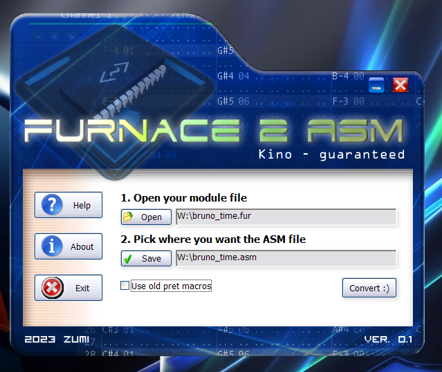

# Furnace2Asm

I rewrote [fur2pret](https://github.com/ZoomTen/chipstuff/blob/master/furnace/fur2pret.py) in Nim rather than continuing [chipchune](https://github.com/ZoomTen/chipchune/). :(

After making [OctoMap](https://github.com/ZoomTen/OctoMap), I [nostalgia-mined](http://archives.somnolescent.net/web/mari_nc2/essays/nostalgiamining.html) some more and attempted to make one of those fancy GBA binary tooling apps but for Pok&eacute;mon disassembly hacking. I tried to approximate the look and feel of [Advance-Text](https://www.romhacking.net/utilities/427/) here because damn, that's some design work for such a simple tool.

Anyway, it functions about the same as the previous Python version (plus the ability to export for both old and new pokecrystal macros) but it **only supports module versions 127&ndash;157**, so you'll have to use Furnace versions between (and including) **0.6pre2&ndash;0.6pre4**. Unless of course, I write support to deserialize both the <127 instrument format *and* the >158 pattern format.

Make sure to click the Help button for more info :p



## Building

Dependencies:
  * [Nim](https://nim-lang.org/) 1.6.0+
    * **Note:** 2.0.0 seems to break compatiblity with XP... (complains about `GetTickCount64` even when `-D_WIN32_WINNT=0x501` is set)
  * [UPX](https://upx.github.io/)
  * Nimble (should come with Nim)

to build CLI only (all platformas):
```
nimble makeRelease
```
to build GUI only **(Windows only!)**:
```
nimble -d:withGui -d:guiOnly makeRelease
```
to build both **(Windows only!)**:
```
nimble -d:withGui makeRelease
```
Cross compiling (works on my machine):
```
nimble -d:withGui -d:mingw makeRelease
```
